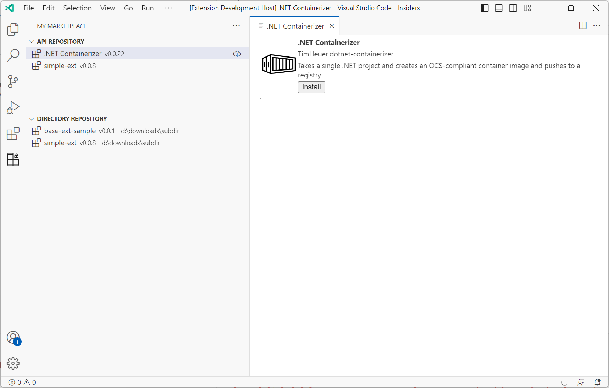

# My Marketplace 
This is a VS Code extension to enable a view of private extensions and a means to install them.

This enables a directory-based or an API based sources to browse.

## Sources
There are two types of sources that this can read:
- API source
- Directory source

### Directory sources
These are local or accessible file-system directories.  This looks at the file system and iterates through `.vsix` files in that directory attempting to extract the manifest to display.  No versioning or anything is bundled here.  It does not recurse directories

### API sources
This relies on an acessible endpoint that conforms to the API schema that is expected.  A copy of the OpenAPI spec is located in this repo at [docs/swagger.json](docs/swagger.json) as to what is expected.

An example implemenation of a web app and API endpoint implemented in Blazor completely is available at [timheuer/mymarketplace](https://github.com/timheuer/mymarketplace).

## Credits
This was inspired by [Prashant](https://github.com/prashantvc)'s https://github.com/prashantvc/extensions repository which is a React front-end application and I wanted to convert this completely to .NET and Blazor.  All credit for the idea and functionality in the initial implementation goes to Prashant.  I've selfishly forked the VS Code extension for various reasons but also originated with Prashant.
